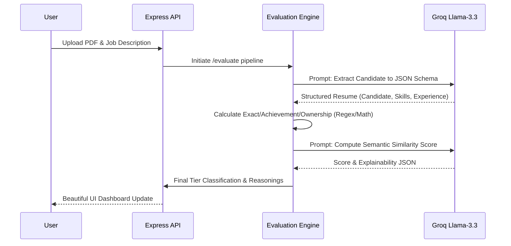

# AI Resume Shortlisting & Interview Assistant System

An automated evaluation and scoring engine that takes a candidate's resume (Text or PDF) and evaluates it against granular Job Description requirements, returning detailed, multi-dimensional score logic. 

**This project fulfills Option A (The Evaluation & Scoring Engine) of the project PRD.**

## Key Features Built
- **PDF Extraction**: Upload a Candidate PDF and automatically parse the raw text.
- **Intelligent Information Structuring**: Uses LLMs via strictly enforced JSON schema rules to extract Candidates into structured Domain Models (Zod).
- **Multi-dimensional Scoring**: Hybrid scoring engine that outputs Exact Match, Semantic Similarity, Achievement Metrics, and Ownership traits.
- **Explainability API**: Returns a deeply detailed JSON log of the exact reasoning behind every individual score.
- **Glassmorphic UI**: Beautiful front-end UX built directly into the server to interact easily with the AI.



## Architecture Documentation
Please review the `SYSTEM_DESIGN.md` file in the root folder for a deep dive into the System Architecture, Data/AI Strategy, and Scalability approaches in alignment with the PRD.

---

## Local Setup & Installation

### Requirements
- Node.js (v18+ recommended)
- A [Groq Console API Key](https://console.groq.com/keys) (Used for lightning-fast Llama-3.3-70b inference)

### 1. Clone the Repository
```bash
git clone https://github.com/mishraa-G/AI-Resume-Screener.git
cd AI-Resume-Screener
```

### 2. Install Dependencies
```bash
npm install
```

### 3. Setup Environment Variables
Create a `.env` file in the root directory and add your Groq API key:
```env
GROQ_API_KEY=your_api_key_here
```

### 4. Run the Development Server
```bash
npm run dev
```

The application will start the Express Backend and concurrently serve the Frontend UI at [http://localhost:3000](http://localhost:3000).

---

## The Tech Stack
- **TypeScript & Node.js**: Language & Runtime
- **Express**: Web Framework Orchestration
- **Zod**: Domain Modeling & Schema Validation
- **Groq API (Llama 3.3 70b)**: Lightning-fast reasoning models via standard OpenAI SDK format.
- **Multer / pdf-parse**: In-memory Multipart File Handling & Data Extraction
- **Vanilla CSS/JS**: Premium Frontend without heavy bundle builds

## Demo Video

https://drive.google.com/file/d/1amNOviNI4PU1X2ykRdPtUzA7qnmW4vPR/view?usp=drivesdk
