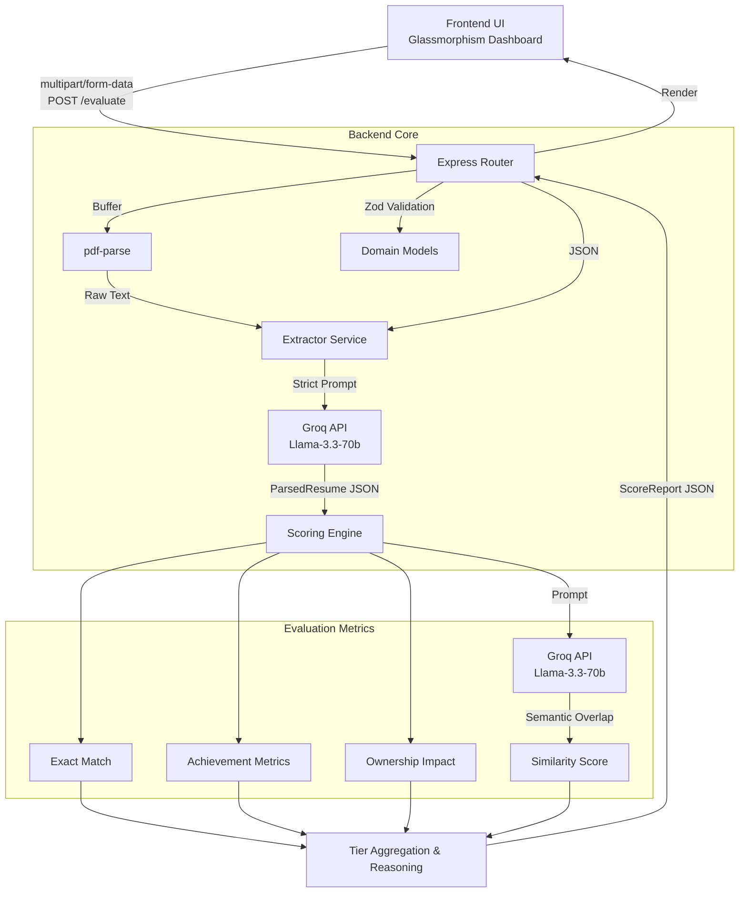

# System Design: AI Resume Shortlisting & Interview Assistant System

## 1. System Architecture

The system follows a modular, monolithic service-oriented architecture using **Node.js** and **Express**, with strict boundary separation between routing, business logic, and external LLM interactions.

### Component Interaction (Option A Focus)
1. **Frontend UI (Static HTML/JS/CSS)**: Reads inputs from the user (Job Description parameters, Resume PDF/Text) and posts a serialized `multipart/form-data` payload.
2. **API Router (`routes.ts`)**: Acts as the orchestration layer. It accepts the file upload (via `multer`), handles text extraction from PDFs (via `pdf-parse`), and validates the structured Job Description using strictly defined **Zod schemas**.
3. **Extraction Service (`extractor.ts`)**: A dedicated module that receives raw, unstructured text and uses a carefully tuned LLM prompt with Structured JSON parameters to map the text accurately to our predefined `ParsedResume` schema. 
4. **Scoring Engine (`scorer.ts`)**: Applies a hybrid approach of deterministic and AI-driven logic to compute four multi-dimensional scores (Exact Match, Similarity, Achievement, Ownership). It returns the total score, Tier classification (A, B, C), and detailed explainability reasoning.

## 2. Data Strategy
### Handling Unstructured Data
Candidate resumes exist primarily as unstructured text or PDFs. 
1. **Ingestion**: When a PDF is uploaded to our Express API, `multer` buffers the file in memory. The buffer is passed to `pdf-parse`, which strips out layout formatting and extracts raw alphanumeric characters.
2. **Structuring**: We use an LLM (Groq Llama-3.3-70b) as an intelligent parser. We pass the raw text and instruct the LLM to map entities directly into our strictly defined Zod schema (Candidate Name, Skills array, Experience array with specific Roles, Companies, and Action Bullets).
3. **Validation**: The structured JSON response from the LLM is validated one final time using our Zod models (`ParsedResumeSchema`). If formatting is malformed, the API appropriately handles the failure, guaranteeing data consistency down the pipeline.

## 3. AI Strategy
### Choice of LLM
- **LLM Engine**: We utilized the **Groq API** (specifically the `llama-3.3-70b-versatile` model). Groq provides unprecedented inference speeds via their LPU, which fundamentally changes the UX of synchronous LLM pipelines like Resume processing. 
- **SDK Compatibility**: We integrated Groq using the standard official `openai` Node.js SDK, enabling easy interchangeability if migrating between OpenAI, Anthropic, or Groq later.

### Handling Semantic Similarity
For the **Similarity Score**, deterministic keyword matching (like our "Exact Match") fails on synonyms and related ecosystem technologies (e.g., comparing "Kafka" vs "AWS Kinesis"). 
- We built an LLM Prompt inside `calculateSimilarityScore` that passes both the structured Candidate Profile and the Job Description parameters strictly evaluating "semantic overlap."
- It utilizes JSON Schema enforcement to guarantee the model returns precisely 1) A constraint-bound Integer Score [0-100] and 2) A concise 1-sentence Explanation.

## 4. Scalability
Handling 10,000+ resumes per day requires moving away from the synchronous architecture shown in this MVP.
1. **Asynchronous Processing**: Introduce a Message Queue (e.g., RabbitMQ, AWS SQS or Kafka). The API router would immediately accept the PDF upload to an S3 bucket and return a `job_id`. 
2. **Worker Nodes**: Dedicated worker services would consume from the queue, download the PDF, perform the extraction, run the scoring engine, and update a Database (PostgreSQL).
3. **Rate Limiting**: Processing 10,000 resumes requires strict management of LLM API Rate Limits. Workers would need exponential backoff retry logic to handle `429 Too Many Requests`.
4. **Embeddings & Vector DBs**: For ultra-high scale semantic similarity, instead of doing an LLM call per resume-to-JD match, we would embed all Candidate Resumes upfront using an embedding model (e.g., `text-embedding-3-small`) into Pinecone. We would embed the JD once, and do a simple, lightning-fast cosine-similarity search against the Vector DB.
